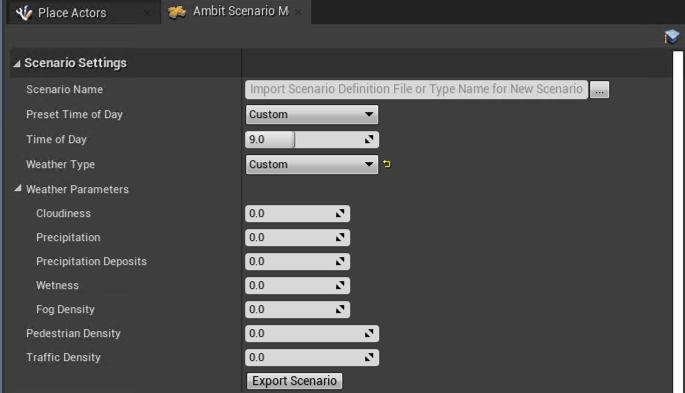

# Individual Scenario Generation

One of the main functionalities Ambit provides is exporting scenarios that can be used for importing into your own scene. A scenario here is defined as a collection of environment effects and objects spawned by [Ambit Spawners](/spawner-parent/) that allow for small variance in a larger scene.

Ambit provides both one-off and bulk scenario generation functionality. In both, Ambit will output a Scenario Definition File (SDF), that can be used for importing your scenario's information into other programs or re-import back to Ambit for verification and editing. 

## Customizing Your Scenario

You can find the **Scenario Settings** menu by selecting **AWS Ambit Scenario Mode** from the list of available modes.



### Environment Variables

You can use pre-set **Time Of Day** and **Weather** options in order to quickly configure your scenario.

If you would like to further customize your environment parameters, you may do so under the **Weather Parameters** section.

### Dynamic Obstacle Densities

If you would like dynamic obstacles in your scenario, set your preferred density via the density parameters.
> **Note:** These parameters are expected to be percentages and therefore set between [0.0 - 1.0].

## Import and Export

To export your scenario, first set your **Scenario Name** in the settings menu.


Next you can click **Export** at the bottom of the **Scenario Settings** menu.


If you would ever like to import your saved scenario and edit it, click the "..." next to the **Scenario Name** field. Doing so will import all of the Scenario Settings that were saved, alongside the spawners and their configurations.


## Scenario Definition File Specification

The output file will be a `*.sdf.json` file, which follows JSON formatting. The specifications for this file are as follows: 
```yaml
Version: This is the version of SDF when it was initially uploaded. 
ScenarioName: Refers to the Scenario Name on screen. This will be the Batch Name when using bulk generation.
TimeOfDay: A value [0,24) that represents the time of day, where the whole number is the hour, and the decimal is the percentgage in that hour. 
WeatherParameters: A group of parameters that represents what the current weather of the scenario should be.
  cloudiness: A value [0,100] that corresponds to how cloudy a scene should be, where 100 is entirely cloudy.
  precipitation: A value [0,100] that corresponds to how much rain should be present in the scene, where 100 is pouring heavily.
  puddles: A value [0,100] that corresponds to how much water puddling should occur on surfaces, where 100 is extremely all covered in a layer water.
  wetness: A value [0,100] that corresponds to how much objects in the scene appear to be wet, where 100 would have an object entirely drenched in water.
  fogDensity: A value [0,100] that corresponds to how much fog should be present in the scene, where 100 has the scene densely covered in fog. 

PedestrianDensity: A value represented as a percent [0,1] to indicate how many pedestrians should be populated to the scene. Currently, Ambit does not use this value. 
VehicleDensity: A value represented as a percent [0,1] to indicate how many vehicles should be populated to the scene. Currently, Ambit does not use this value.
AllSpawnerConfigs: A list of spawner configurations by type. 
  AmbitSpawner*: An individual type of spawner that has specified values for it. Each spawner has its own settings.

AmbitSpawner: An object representative of static obstacles being spawned by Ambit Spawners.
  SpawnedObjects: A list representative of all static objects that should be spawned to screen.
    ActorToSpawn: A path to the actor that should be spawned. This is generally a relative path.
    Location: The spawned location (x, y, z) of the object relative to the world. 
    Rotation: The spawned rotation (x, y, z) of the object relative to the world. 

VehiclePathGenerator: An object representative of dynamic obstacle pathing. 
  VehicleToSpawn: A path to the actor that should be spawned. This is generally a relative path.
  SpeedLimit: The speed of the vehicle in cm/s.
  Waypoints: A list of positions on the scene (x, y, z) that the vehicle should pass through. 
```
